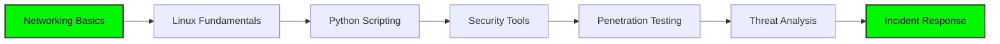

# Hi there, I'm Ameed Hazza Ali Mohammed 👋

<p align="center">
  
</p>

## 🛡️ About Me

Information Technology graduate passionate about **Cybersecurity** and **Ethical Hacking**. I focus on building practical security tools, analyzing vulnerabilities, and understanding how systems can be secured against modern threats.

```python
class SecurityEngineer:
    def __init__(self):
        self.name = "Ameed Hazza"
        self.role = "Cybersecurity Enthusiast"
        self.focus = ["Ethical Hacking", "Network Security", "Python Automation"]
        self.currently_learning = ["Penetration Testing", "SIEM", "Threat Intelligence"]
    
    def say_hi(self):
        print("Thanks for stopping by! Let's secure the digital world together.")

me = SecurityEngineer()
me.say_hi()
```

## 🔧 Technical Stack

### Languages


### Operating Systems & Platforms


### Security Tools & Frameworks

<table>
<tr>
<td valign="top" width="33%">

#### 🔍 Reconnaissance
- Nmap
- Netcat
- Whois/DNS Tools

</td>
<td valign="top" width="33%">

#### 🎯 Exploitation
- Metasploit Framework
- Burp Suite (Basics)
- SQLMap

</td>
<td valign="top" width="33%">

#### 📊 Analysis
- Wireshark
- Tcpdump
- SIEM Concepts

</td>
</tr>
</table>

### Networking & Protocols
- TCP/IP Stack & OSI Model
- Network Traffic Analysis
- Firewalls & IDS/IPS Concepts
- VPN Technologies
- DNS & DHCP

### Security Frameworks
- **NIST Cybersecurity Framework**
- **MITRE ATT&CK Framework**
- **OWASP Top 10**

## 💻 Featured Projects

### 🔐 Security Tools
Coming soon... Building practical cybersecurity tools:
- Port Scanner & Network Mapper
- Password Strength Analyzer
- Vulnerability Scanner
- Network Traffic Monitor
- SQL Injection Testing Tool (Educational)

### 🌐 Web Security
- Security-focused web applications
- Vulnerability demonstration labs
- Security checklists & guides

### 📝 CTF Writeups & Labs
- Capture The Flag solutions
- Security challenge walkthroughs
- Hands-on practice documentation

> **Note**: All projects are for educational purposes and ethical security research only.

## 📊 GitHub Stats

<p align="center">
  
</p>

<p align="center">
  
</p>

<p align="center">
  
</p>

## 🎯 Learning Path



## 🔨 What I'm Working On

- 🛠️ Building security automation tools with Python
- 🌐 Practicing on TryHackMe & HackTheBox
- 📚 Studying penetration testing methodologies
- 🔍 Analyzing real-world vulnerabilities
- 💡 Contributing to open-source security projects

## 📫 Connect With Me

<p align="left">
  <a href="https://www.linkedin.com/in/ameed-mohammed-858603301"></a>
  <a href="https://x.com/EngAmeed31505"></a>
  <a href="mailto:ameedhaza@gmail.com"></a>
</p>

## 💡 Security Quote

> *"Security is not a product, but a process."* - Bruce Schneier

---

<p align="center">
  
</p>

<p align="center">
  <i>⚠️ All security tools and projects are created for educational purposes and ethical security research only.</i>
</p>

<p align="center">⭐️ From <a href="https://github.com/ameed25mohammed">Ameed Hazza</a> | 🛡️ Securing the Digital World</p>
